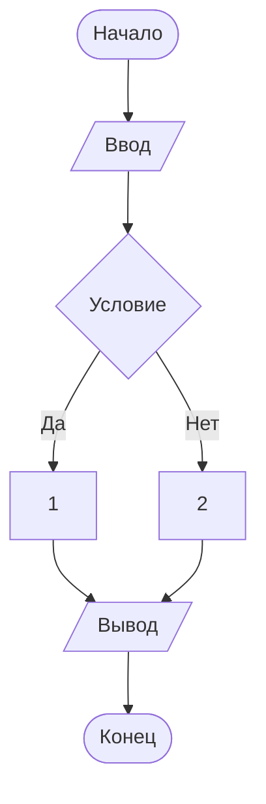

Министерство науки и высшего образования Российской Федерации

Федеральное государственное бюджетное образовательное учреждение высшего образования «Уфимский университет науки и технологий»

Кафедра АСУ

# Отчёт по лабораторной работе по предмету «Основы современных цифровых технологий и искусственного интеллекта» №3 «Диаграмма как код»

ИВТ-ИСУ-102Б

Ишмиев А. Р.

г. Уфа

2024 г.

### Алгоритм

Алгоритм - это определённый порядок действий для выполнения определённой задачи. Это слово произошло от имени персидского иатематика Аль-Хорезми: написанная им книга об арифметике стала популярна в Европе, и его именем стали называть вычисления
в десятичной системе, а позднее и любые вычисления, выполняемые по строго определённым правилам.

Источники:

https://ru.wikipedia.org/wiki/Алгоритм

https://ru.wikipedia.org/wiki/Аль-Хорезми

### Блок-схемы


*Примеры условных обозначений блок-схем*

Источник: https://ru.wikipedia.org/wiki/Блок-схема

### От блок-схем к схемам алгоритмов

Термин "блок-схема" постепенно выпал из употребления из-за нескольких причин, таких, как повышение уровня абстракции,
добавления многих алгоритмов в стандартные библиотеки таких языков, как Python и JS. Происходил этот переход с конца 1990-х по 2000-е годы.

Источник: GigaChat, запрос "Почему блок-схемы алгоритмов со временем стали называть просто схемами алгоритмов и когда примерно это произошло?"

### Стандарт для схем алгоритмов

Стандарт для схем алгоритмов называется ГОСТ-19.701-90 (ИСО 5807-85).

### Workflow Diagram

Workflow Diagram - диаграмма, похожая по своей сути на схему алгоритма, только описывающая не определённый алгоритм, выполняемый ЭВМ,
а рабочий (производственный) процесс.

Источник: GigaChat, запрос "Что такое Workflow Diagram?"

### Draw.io


*Выбор шаблона на Draw.io*


*Пример схемы на Draw.io*

Схему можно сохранить в 4 форматах - *.drawio, *.svg, *.png, *.html.
Файлы формата *.drawio можно открыть в самом же Draw.io и продолжить работу над схемой, файлы *.png можно просмотреть
в любом ПО для просмотра изображений, а файлы *.svg и *.html можно открыть в браузере.
При этом *.png, в отличие от 3 других форматов, заметно теряет качество при увеличении.
Это связано с тем, что *.png - растровый формат, т.е. содержит информацию о пикселях, составляющих изображение,
а остальные - векторные, т.е. содержат инструкции для компьютера, как нарисовать картинку из фигур.
Что интересно, полученный файл *.html использует удалённый скрипт для отрисовки схемы.

```html
<script type="text/javascript" src="https://app.diagrams.net/js/viewer-static.min.js"></script>
```

Отключаем компьютер от всемирной сети и убеждаемся, что не открывается.


### Terminator

Английское слово terminator происходит от латинского слова terminus, означающего "граница, лимит, конец".
Означает оно, помимо ассасина, маркер, показывающий окончание чего-либо.

Источники:

https://en.wiktionary.org/wiki/terminator#English

https://en.wiktionary.org/wiki/terminus#Latin

### Mermaid


*Простая схема в Mermaid*

Сохранив схему в *.png и *.svg и приблизив, получаем ожидаемые результаты - у *.png видны пиксели, в отличие от *.svg.

Кнопка "Copy image to clipboard" копирует изображение схемы в формате *.png:


*Вставленное изображение схемы*

Также скопируем ссылку на изображение. Она длинная и некрасивая, поэтому [спрячем](https://mermaid.ink/img/pako:eNotTTsOwjAMvUrkiUrtBTog8bkBY9MhatKP1DQoJEKo6sIAd0BiZu1AJ6BncG-Ei_DwZL-fW8iMVBBDXptjVgrreMNoVosE79hPV-zxhWMasChasnWCj-mMYzQDwycOJPaE7_Snbyh1wxE_OEyXNJirIAStrBaVpCftzHBwpdKKQ0yrVLnwtePAm46swjuzOzUZxM56FYI1vighzkV9oMvvpXBqW4nCCv1nuy9Lg1AI?type=png) её магией Markdown.


*Две немного разных схемы в Colab*



*Схема, написанная кодом*


*Диаграмма в кодовом блоке Colab*


*Та же диаграмма в текстовом блоке*

### Base64

Base64 - способ кодирования, позволяющий закодировать произвольную последовательность байт с помощью ограниченного набора из 64 символов
для передачи по каналам, поддерживающим передачу только текстовых данных.
Как правило, это цифры, заглавные и строчные английские буквы и 2 каких-то спецсимвола: в сумме 10+26+26+2=64 символа.

### Mermaid + VS Code


*Диаграмма в VS Code*

### Mermaid + Docker


*Mermaid Live Editor, запущенный через Docker*


*Удаление контейнера*


*Удаление образа*

### Почему Mermaid?

Название Mermaid - это игра слов от слова "merging" - объединение. Идея заключается в том, чтобы объединить различные типы диаграмм (например, блок-схемы, графы и т.д.) в единую систему. Этот инструмент также позволяет легко интегрировать различные виды диаграмм с помощью синтаксиса Markdown или обычного текста.

Источник: GigaChat, запрос "Почему технологию создания диаграмм Mermaid так назвали?"

### PlantUML

PlantUML поддерживается огромным количеством программных средств, среди них VS Code, Notepad++ и IDE от JetBrains.

Источник: https://en.wikipedia.org/wiki/PlantUML

### ИИ - карьерный консультант

Запрос: Вы являетесь чатботом-карьерным консультантом, к которому обращаются люди за советами по выбору профессии и карьерному развитию. Ваша задача — помогать пользователям определить их интересы, сильные стороны и потенциальные возможности для профессионального роста. Вы должны быть способны проводить интервью, задавать уточняющие вопросы и предоставлять полезную информацию о различных профессиях и образовательных программах.

Результат: чатбот посоветовал профессию frontend-разработчик.

### Делаем mind map


*Начальная версия карты*


*Добавляем переносы*


*Упрощённая версия схемы*


*Схема, созданная ChatGPT (GigaChat с задачей не справился)*

### Профессиональный стандарт


*Схема на основе профстандарта*

Источник: Профессиональный стандарт 06.035 "Разработчик Web и мультимедийных приложений"


*Доработанная схема*


*Объединённая схема*

### Цвета


*Раскрашенная схема*

### Yandex Wiki


*Редакторы WYSIWYG и Markdown*

### WYSIWYG

WYSIWYG означает what you see is what you get (что видишь, то и получишь). Означает то, что финальный результат будет выглядеть так же,
как и во время редактирования.

### Yandex Wiki + Draw.io


*Блок-схема Draw.io на Yandex Wiki*


*История изменений*

### PlantUML + VS Code


*Просмотр PlantUML в VS Code*

### PlantUML + Docker

1. Первая команда:
   `docker run -d -p 8080:8080 plantuml/plantuml-server:jetty`
   
   Здесь мы видим следующие параметры и значения:
   - -d: запуск контейнера в фоновом режиме (демон)
   - -p 8080:8080: назначение порта внутри контейнера (8080) на внешний порт хоста (8080). Это позволяет обращаться к сервису извне через указанный порт.
   - plantuml/plantuml-server:jetty: образ контейнера для сервера PlantUML, основанного на Jetty.
3. Вторая команда:
   `docker run -d -p 8080:8080 plantuml/plantuml-server:tomcat`
   
   Эта команда аналогична первой, но использует другой образ:
   - plantuml/plantuml-server:tomcat: образ контейнера для сервера PlantUML, основанного на Tomcat.
  
Источник: GigaChat, запрос "Объясни эти команды. docker run -d -p 8080:8080 plantuml/plantuml-server:jetty docker run -d -p 8080:8080 plantuml/plantuml-server:tomcat"


